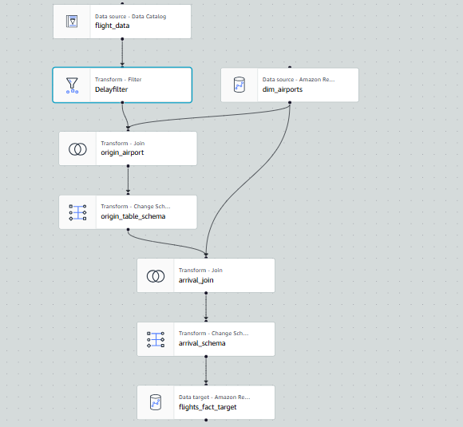

# ✈️ Airline Delay Analytics – AWS Glue Data Pipeline

This project implements a serverless ETL pipeline using AWS services to process airline flight data and extract records of flights delayed by more than **60 minutes**. The final output is stored in an **Amazon Redshift** table for analytical querying and reporting.

---

## 📌 Project Overview

The pipeline automates the ingestion, transformation, and loading of large volumes of airline data. It filters significantly delayed flights and constructs a **Fact Table** that supports downstream BI and analytics use cases.

---

## 🛠️ AWS Stack

| Service           | Purpose                                                                 |
|------------------|-------------------------------------------------------------------------|
| **Amazon S3**     | Stores raw airline data (CSV/Parquet)                                   |
| **AWS Glue**      | Performs ETL using PySpark and creates a curated dataset                |
| **Glue Crawlers** | Detects schema and updates the Glue Data Catalog                        |
| **Step Functions**| Orchestrates the ETL pipeline steps including job monitoring            |
| **Amazon Redshift** | Stores the final fact table with delayed flight data for analysis    |
| **Amazon SNS**    | Sends pipeline status notifications (success/failure) via email         |
| **Amazon Eventbridge**  | Triggers the stepfunction when csv file landed in S3 bucket     |

---

## 🔄 ETL Workflow

1. **Raw Data Upload**: Airline data is uploaded to an S3 bucket.
2. **Schema Inference**: Glue Crawler runs to catalog the data into the Glue Data Catalog.
3. **ETL Transformation (Glue Job)**:
   - Cleans and transforms the data
   - Filters flights with delays > 60 minutes
   - Prepares a fact table with relevant fields
4. **Data Load to Redshift**: Transformed data is directly written to a Redshift table.
5. **Notification**: SNS sends success/failure notification upon completion.

---

## 🧾 Output – Fact Table Schema (in Redshift)

| Column Name        | Description                            |
|--------------------|----------------------------------------|
| flight_date        | Date of the flight                     |
| airline_code       | Airline carrier code                   |
| origin             | Departure airport code                 |
| destination        | Arrival airport code                   |
| dep_delay_minutes  | Departure delay in minutes             |
| arr_delay_minutes  | Arrival delay in minutes               |

Only flights with a **departure or arrival delay > 60 minutes** are included in this fact table.

---

## 📊 Use Cases

- Delay pattern analysis by route or carrier
- Integration with BI tools (e.g., Amazon QuickSight)
- Performance monitoring and SLA tracking

---

## 🖼️ Visual ETL Pipeline

---

## 📬 Notifications

SNS sends an email alert on:
- ✅ Successful ETL completion
- ❌ ETL failure or exceptions

---

